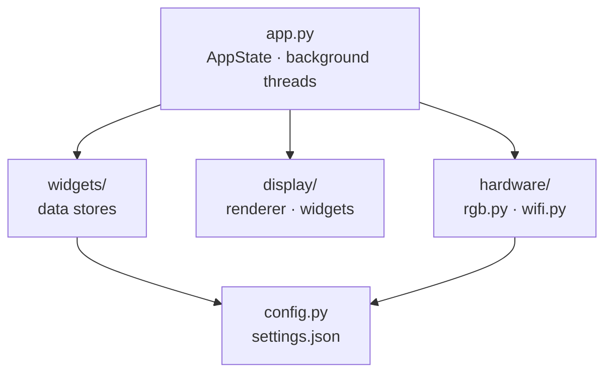
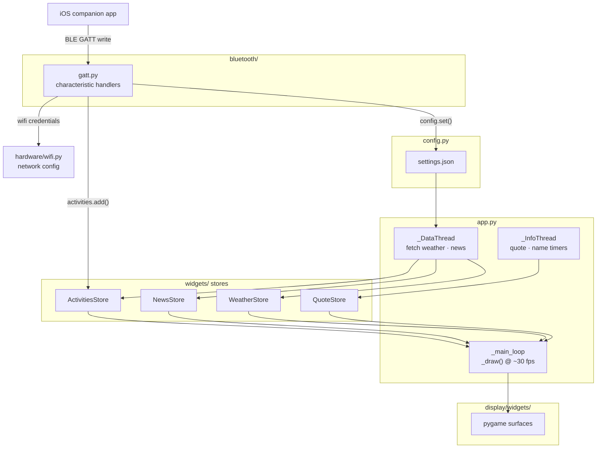
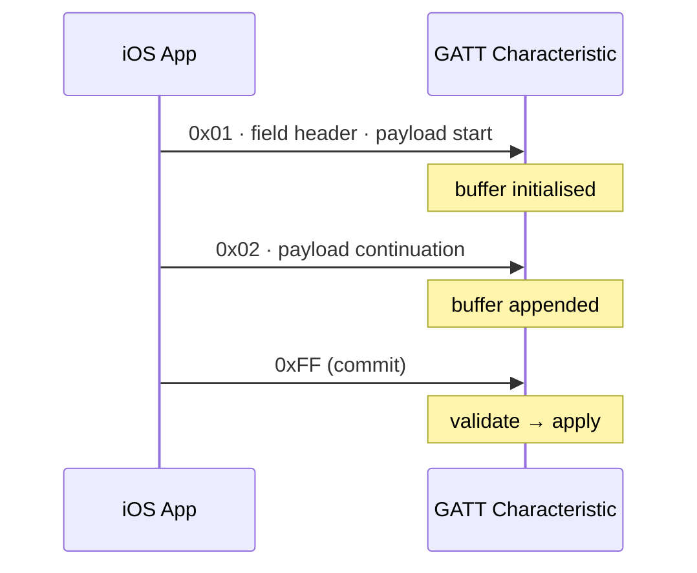
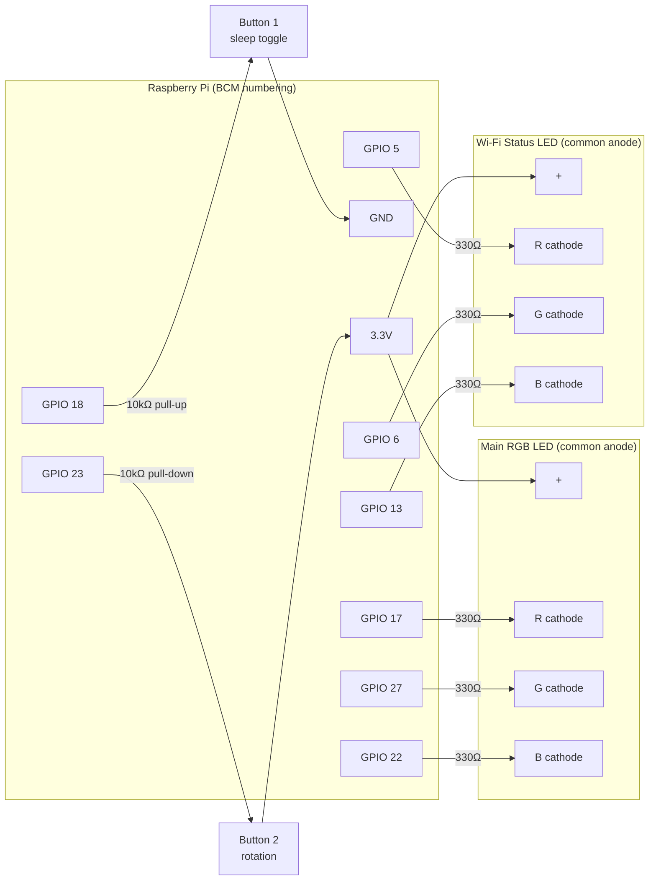

# OMirror Architecture

## Overview

---

## Module map

### `src/omirror/`

| File | Responsibility |
|------|---------------|
| `app.py` | Main loop, `AppState` dataclass, background data + info threads, button polling, `_draw()` |
| `config.py` | Thread-safe `get()`/`set()` over `settings.json`; atomic write via `.tmp` → `os.replace()` |
| `const.py` | All `Path` constants (`IMAGES_DIR`, `FONTS_DIR`, `CACHED_DIR`, `SETTINGS_FILE`, …) and `in_time_window()` |
| `main.py` | Entry point (`omirror` script) |

### `src/omirror/widgets/` — data modules (no pygame)

Each module exposes a module-level singleton whose list attributes are mutated in-place so external references stay valid across reloads.

| Module | Class | Persists to |
|--------|-------|-------------|
| `activities.py` | `ActivitiesStore` | `cached/activities.json` |
| `news.py` | `NewsStore` | `cached/news.json` |
| `weather.py` | `WeatherStore` | `cached/weather.json` |
| `quotes.py` | `QuoteStore` | `cached/quotes.json` |

### `src/omirror/display/`

| File | Responsibility |
|------|---------------|
| `renderer.py` | `BoxContainer`, `Fader`, `text_surface()` pygame primitives |
| `centered_text.py` | `CenteredTextStore` — time-windowed overlay entries |
| `text_utils.py` | `split_words()` — word-wrap helper |
| `widgets/` | One pygame widget class per data domain (weather, news, activities, quote, name, datetime, overlay, loading) |

### `src/omirror/hardware/`

| File | Responsibility |
|------|---------------|
| `rgb.py` | `RGBController` — pigpio PWM for main RGB LED, lgpio digital I/O for buttons and Wi-Fi LED |
| `wifi.py` | `wpa_supplicant` / `nmcli` network provisioning |

### `src/omirror/bluetooth/`

| File | Responsibility |
|------|---------------|
| `server.py` | Entry point (`omirror-bt` script); starts the BlueZ GATT server and GLib main loop |
| `gatt.py` | All GATT characteristic handlers — multi-packet BLE protocol, config writes, activity updates |
| `adapters.py` | BlueZ adapter discovery and power-on |
| `advertising.py` | LE advertisement registration |
| `exceptions.py` | Custom BLE exception types |

---

## Data flow

---

## Threading model

```mermaid
gantt
    title Thread responsibilities (conceptual — not time-scaled)
    dateFormat X
    axisFormat %s

    section main thread
    pygame event loop     :a1, 0, 3
    _draw() @ ~30 fps     :a2, 0, 3
    handle_buttons()      :a3, 0, 3

    section _DataThread
    fetch weather / news  :b1, 0, 3
    activities.remove_past() :b2, 0, 3
    config.load()         :b3, 0, 3

    section _InfoThread
    quote / name rotation :c1, 0, 3
    autosleep timer       :c2, 0, 3
```

All cross-thread state lives in `AppState` (plain Python assignments are GIL-protected for simple types). The `widgets/` stores have no internal locks — written only by `_DataThread`, read only by the main thread.

`config.py` has its own `threading.Lock` because both threads call `get()`/`set()` directly.

---

## BLE multi-packet protocol

Characteristics that carry more data than fits in a single BLE write (20 bytes) use a three-packet-type protocol:

| Type byte | Meaning |
|-----------|---------|
| `0x01` | First packet — field header + start of payload |
| `0x02`–`0xFE` | Continuation — appended to in-progress buffer |
| `0xFF` | Commit — buffer validated and applied |

The buffer is held as instance variables on each characteristic class (`self._ssid`, `self._akt_string`, etc.) so there is no shared mutable state between concurrent connections.

---

## Breadboard wiring

### Pin summary

| GPIO (BCM) | Role | Driver | Logic |
|-----------|------|--------|-------|
| 17 | Main LED — Red | pigpio hardware PWM | — |
| 27 | Main LED — Green | pigpio hardware PWM | — |
| 22 | Main LED — Blue | pigpio hardware PWM | — |
| 5 | Wi-Fi LED — Red | lgpio digital output | — |
| 6 | Wi-Fi LED — Green | lgpio digital output | — |
| 13 | Wi-Fi LED — Blue | lgpio digital output | — |
| 18 | Button 1 (sleep toggle) | lgpio input | active-low, pull-up |
| 23 | Button 2 (rotation) | lgpio input | active-high, pull-down |

> **LED driver note:** The main RGB LED is driven by pigpio's hardware-timed PWM for flicker-free brightness control. The Wi-Fi status LED only needs on/off, so it uses lgpio digital output. Both libraries coexist — pigpio for PWM, lgpio for digital I/O.

---

## Settings reference

All runtime configuration is stored in `settings.json` at the repo root and loaded at start-up. Use `settings.local.json` for personal overrides (API keys, dev tweaks) — it is gitignored and merged on top of `settings.json` at load time.

| Key | Type | Description |
|-----|------|-------------|
| `name` | string | Name shown on the mirror |
| `weather_city` | string | City for OpenWeatherMap |
| `weather_country` | string | Two-letter ISO country code (e.g. `"GB"`) |
| `weather_api` | string | OpenWeatherMap API key — keep in `settings.local.json` |
| `rotation` | 0–3 | Display rotation (0 = default portrait) |
| `autosleep` | 0/1 | Enable auto-sleep |
| `autosleep_time` | `"HH:MM,HH:MM"` | Sleep window start and end |
| `pota_delay` | int | Seconds to show the name card |
| `quote_delay` | int | Seconds to show the quote card |
| `rgb_mode` | 0–2 | LED mode: 0 off, 1 single colour, 2 flash |
| `rgb_single` | `"R,G,B"` | Static LED colour |
| `rgb_flash_sequence` | `"R,G,B:R,G,B:…"` | Colour sequence for flash mode |
| `rgb_flash_delay` | int (ms) | Delay between flash steps |
| `rgb_fade_delay` | int | Fade speed |
| `news_rss` | URL | RSS feed URL |
| `news_max` | int | Maximum news items to display |
